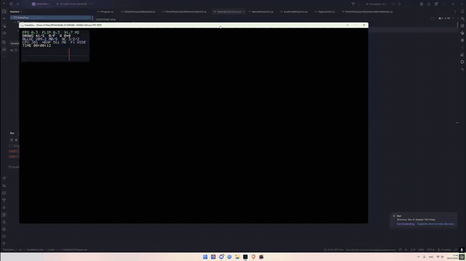
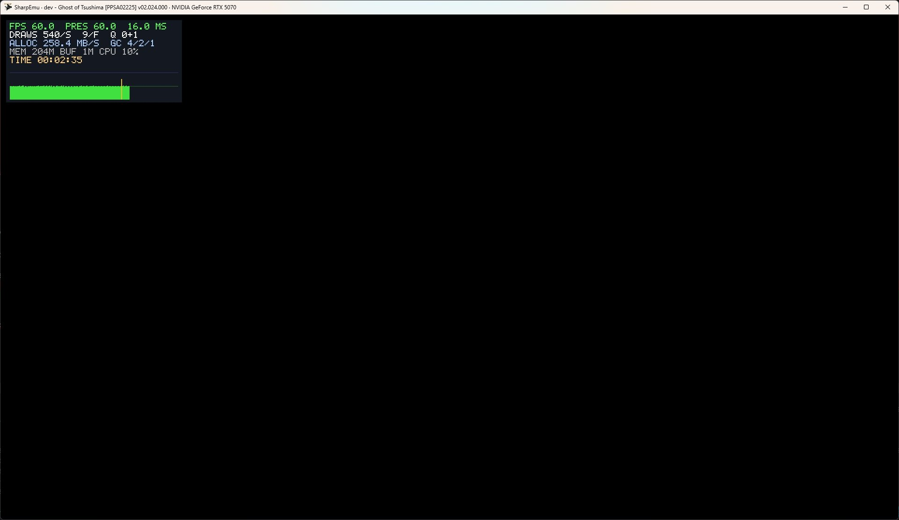
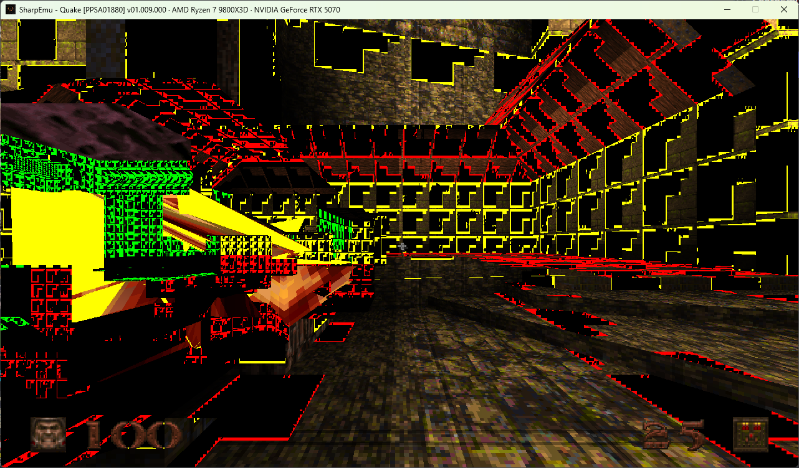

<!--
Copyright (C) 2026 SharpEmu Emulator Project
SPDX-License-Identifier: GPL-2.0-or-later
-->

# SharpEmu

<p align="center">
  
</p>

<p align="center">
  An experimental PlayStation 5 emulator for Windows, Linux and macOS.  
</p>

<p align="center">
  <a href="https://discord.gg/6GejPEDqpc">
    
  </a>
</p>

<p align="center">
  <strong>Join our Discord for development updates, compatibility discussions, support, and community chat.</strong>
</p>

---

> [!NOTE]
> **This fork.** This is [Foued Attar](https://github.com/foufouadi)'s development fork of
> [`sharpemu/sharpemu`](https://github.com/sharpemu/sharpemu). It tracks upstream and includes
> additional boot-stability fixes, GPU/AGC work, and diagnostic tools. See
> **[My Contributions](#my-contributions)** for the changes specific to this fork, along with
> commit references and result media.

---

> [!NOTE]
> SharpEmu supports Windows x64, Linux x64, and macOS x64. Apple Silicon Macs
> can run the macOS x64 build through Rosetta 2.

## Info

SharpEmu is an emulator project in the early stages of development.

It is developed for research and educational purposes, with no commercial goals. The project focuses on system architecture and reverse engineering.

SharpEmu targets the PlayStation 5 exclusively. It does **not** aim to emulate PS4 games; **ShadPS4** already covers that platform.

## My Contributions

This fork contains **89 commits on `main`, 84 ahead of `upstream/main`**
(+14.4k / -974 lines), covering the CPU core, GPU/AGC pipeline, shader recompiler, and HLE.

| Ghost of Yotei — intro cinematic | Ghost of Tsushima — ~60 FPS | Quake — render investigation |
|:---:|:---:|:---:|
|  |  |  |

> The Quake capture is a development snapshot from the texture-aliasing investigation
> described below. It is not reliably reproducible on the current build; see
> `fix/quake-render-aliasing`.

**Highlights:**

- Fixed an incorrectly encoded `lock cmpxchg` instruction in the native exception-handling trampoline ([`2055077`](https://github.com/foufouadi/sharpemu/commit/2055077) and three follow-up fixes). The bug left the game's main thread in an infinite spin loop. Ghost of Tsushima now boots and runs continuously at ~60 FPS, although rendering is still incomplete.
- Got the Ghost of Yotei intro cinematic to play using the diagnostic launch flags documented below.
- Fixed a GPU arena and fence-tracking stall that blocked the first frame in Demon's Souls (#770, on the `integration/upstream-latest` branch, not yet merged to `main`). The game now runs about five times farther before stopping.
- Investigated Quake's wireframe-like rendering artifact. The current evidence points to texture aliasing rather than a rendering mode. Work continues on `fix/quake-render-aliasing`.
- Added other fixes in the GPU/Vulkan code, shader recompiler (GCN opcode decoding), HLE, and audio code.

<details>
<summary><strong>Technical details</strong></summary>

**The VEH lock bug:** `CreateExceptionHandlerTrampoline` emitted
`lock cmpxchg [r9], r10` with the wrong REX byte (`0x4C` instead of `0x4D`). The
instruction therefore operated on `[rcx]` rather than the actual lock in `[r9]`, leaving
threads in a spin loop without an error or crash. The issue was identified using an
in-process stack walk and raw instruction-byte disassembly after an ETW trace ruled out
the Windows scheduler.

Fixing the lock exposed three other issues: two poison-pointer recovery paths and an
overly strict `sceAjmInitialize` parameter check
([`f070503`](https://github.com/foufouadi/sharpemu/commit/f070503),
[`8e04a22`](https://github.com/foufouadi/sharpemu/commit/8e04a22), and
[`242959a`](https://github.com/foufouadi/sharpemu/commit/242959a)). A test lasting more
than two minutes completed with no native exceptions or stall-watchdog events, at about
60 FPS and 540 draws per second. The game now runs continuously, but the color buffers
still do not contain the expected scene output.

**Ghost of Yotei cinematic recipe:**

```ini
SHARPEMU_FORCE_SPIN_FLAG_RIP=0x800D92942
SHARPEMU_FORCE_SUBMIT_ORPHAN_PREAMBLES=1
```

This is a diagnostic workaround. It force-clears a spin-wait flag at a known address;
the subsystem that should normally clear the flag has not yet been identified.

**Quake:** SharpEmu does not contain a wireframe or debug-view rendering mode, and the
game's own wireframe request is forced to solid fill before it reaches Vulkan. The
artifact is more consistent with a stale depth- or normal-shaped GPU resource being
sampled as a color texture, which can produce colored edges on each triangle. Regression
coverage for this hypothesis was added on `fix/quake-render-aliasing`.

</details>

## Using

Download the release archive for your operating system, extract it, and launch
SharpEmu with the path to a legally obtained game's `eboot.bin`.

Windows PowerShell:

```powershell
.\SharpEmu.exe "C:\path\to\game\eboot.bin" 2>&1 |
  Tee-Object -FilePath "SharpEmu.log"
```

Linux and macOS:

```bash
chmod +x ./SharpEmu

./SharpEmu "/path/to/game/eboot.bin" 2>&1 |
  tee SharpEmu.log
```

A Vulkan-capable GPU and a current graphics driver are required. The macOS release
includes the MoltenVK Vulkan implementation.

> [!IMPORTANT]
> This project does **not** support or condone piracy.  
> All games used during development and testing are dumped from consoles that we personally own.  
> Users are expected to use legally obtained copies of their games.

## Build

1. Install the .NET SDK version specified in [`global.json`](./global.json).
2. Clone the repository: `git clone https://github.com/sharpemu/sharpemu.git`
3. Open the solution file (`SharpEmu.slnx`) in **VSCode**.
4. Build the project with `dotnet build` or `dotnet publish`.
5. Build artifacts are written to the `artifacts` directory.

## Disclaimer

SharpEmu is an experimental emulator intended for research and educational purposes.

The project does not contain copyrighted system firmware, game data, or proprietary PlayStation assets.

## Special Thanks

The following projects were useful during development:

- **[ShadPS4](https://github.com/shadps4-emu/shadPS4)**  
  Helped with understanding the basic architecture of the PlayStation 4.

- **[Kyty](https://github.com/InoriRus/Kyty)**  
  One of the few available PS5 emulator projects and a useful reference for native code execution.

- **Ryujinx**  
  Provided references for filesystem handling and low-level C# implementation patterns.

# License

- [**GPL-2.0 license**](https://github.com/sharpemu/sharpemu/blob/main/LICENSE)

## Contributing

Before opening an issue or pull request, read the contribution guidelines:

**[CONTRIBUTING.md](./CONTRIBUTING.md)**

The guide covers:

- Coding style and formatting
- AI-assisted contributions
- Pull request expectations
- Testing guidelines
- Legal and reverse engineering policy
